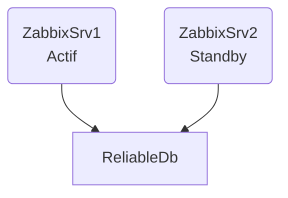

# Zabbix High-Availability

C'est l'adaptation Zabbix pour être [[20230703-10.07 - High Availability|Highly Available]].

## Architecture

Des hôtes serveurs font le même procédé que d'habitude. Sauf qu'ils sont plusieurs. Chacun d'eux se connecterons sur une base de donnée distribué qui leurs permettront de reprendre le contrôle si une panne survenait sur un autre des serveurs. Il documente que chaque serveurs sont soit en mode actif, indisponible, ou *Standby*. En cas qu'un serveur actif venait à tomber en panne, un serveur *Standby* prendrais le relais. Les nodes monitor la connectivité vers leur base de donnée et les autres nodes, si la base de donnée est indisponible, un serveur actif tombera en mode standby. 



## Configuration

Voici une brève explication de la configuration nécessaire pour démarrer un serveur Zabbix en mode HA.

### Obligatoire

`HANodeName`: c'est un identifiant unique que les proxy et agents vont utilisés pour se connecter.
`NodeAddress (address:port)`: c'est l'IP du serveur ainsi que sont port. C'est utilisé pour la connexion vers le front-end.

### Frontend

Sur chaque serveur, il est important de commenter `$ZBX_SERVER` et `$ZBX_SERVER_PORT` afin de lui permettre de découvrir le serveur actif par lui-même. Le fichier de configuration est `zabbix.conf.php`, et il est (probablement) dans `/etc/zabbix`.

### Proxy

#### Actif

Pour un proxy actif, il faut mettre dans le champs `Serveur` la liste de tous les serveurs. S'il est actif, le séparateur de nom de node est une virgule:
```
Server=zabbix-node-01,zabbix-node-02
```

#### Passif

Pour un proxy passif, il faut mettre dans le champs `Serveur` la liste de tous les serveurs. S'il est passif, le séparateur de nom de node est une point-virgule:
```
Server=zabbix-node-01;zabbix-node-02
```

### Agent

Chaque agents doivent avoir la liste de tout les serveurs et/ou proxy qu'il vont *pouvoir* accéder.

Pour les informations passives:
```
Server=zabbix-node-01,zabbix-node-02
```

Pour les informations actives:
```
ServerActive=zabbix-node-01;zabbix-node-02
```

## Opération

Afin de connaître le status d'un cluster HA, il est possible d'entrer `zabbix_server -R ha_status`, qui permet d'obtenir la liste des serveurs HA configurés avec certaine information. 

# References
1. https://www.zabbix.com/documentation/current/en/manual/concepts/server/ha