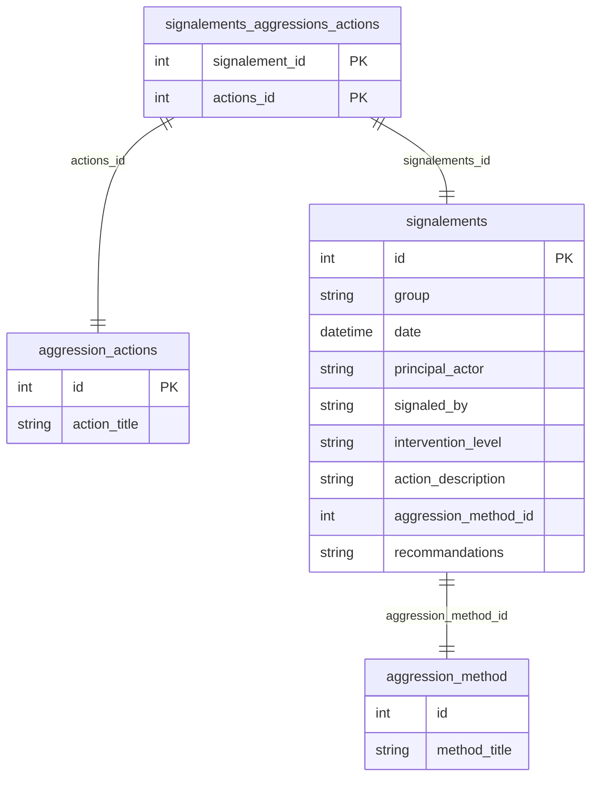

# Goal
This is a personal project to build a TUI to help automate generating Word forms.

# The Data
What does the data looks like? It should be looked into.

```mermaid
erDiagram
aggression_method {
	int id
	string method_title
}

aggression_actions {
	int id PK
	string action_title
}

signalements_aggressions_actions {
	int signalement_id PK
	int actions_id PK
}

signalements {
	int id PK
	string group
	datetime date
	string principal_actor
	string signaled_by
	string intervention_level

	string action_description

	int aggression_method_id
	string recommandations
}

signalements ||--|| aggression_method : aggression_method_id
signalements_aggressions_actions ||--|| signalements: signalements_id
signalements_aggressions_actions ||--|| aggression_actions: actions_id
```
