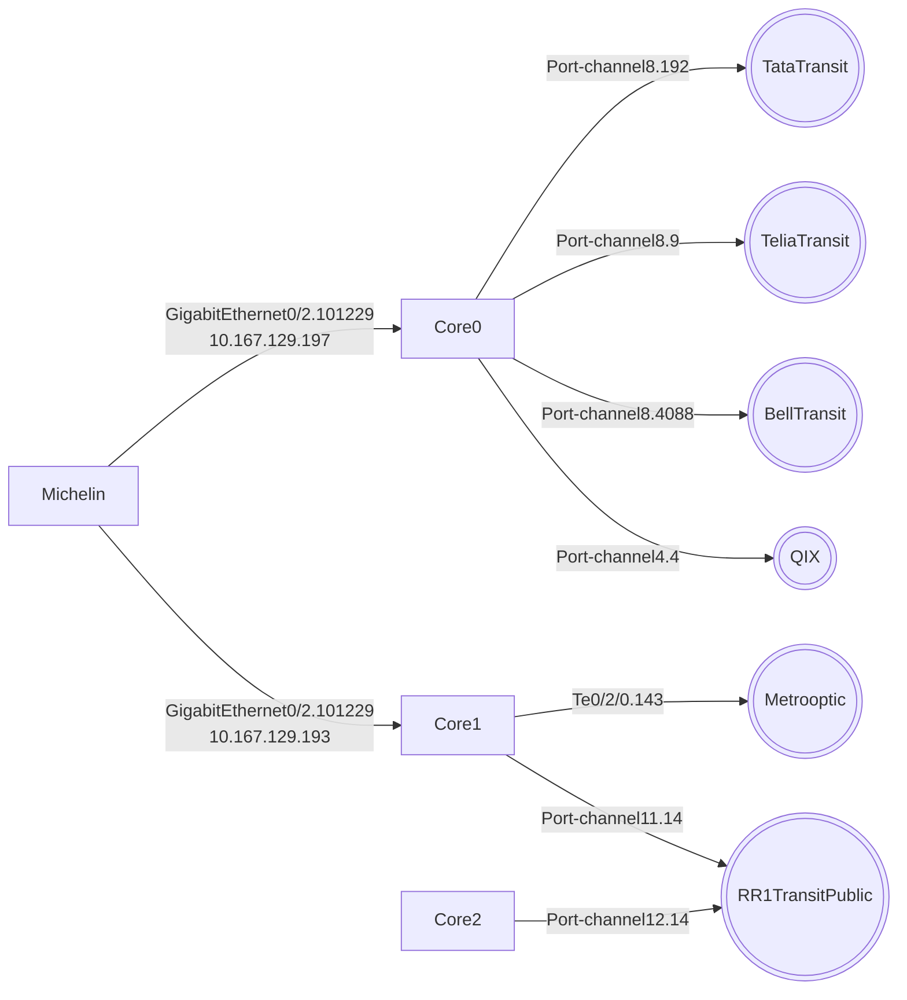

Voici une documentation de notre architecture réseau.

```mermaid
flowchart LR

Michelin -->|GigabitEthernet0/2.101229 \n 10.167.129.197| Core0
Michelin -->|GigabitEthernet0/2.101229 \n 10.167.129.193| Core1

Core0 -->|Port-channel8.192| Tata(((TataTransit)))
Core0 -->|Port-channel8.9| Telia(((TeliaTransit)))
Core0 -->|Port-channel8.4088| Bell(((BellTransit)))
Core0 -->|Port-channel4.4| QIX(((QIX)))

Core1 -->|Te0/2/0.143| Metrooptic(((Metrooptic)))
Core1 -->|Port-channel11.14| RR1(((RR1TransitPublic)))

Core2 -->|Port-channel12.14| RR1(((RR1TransitPublic)))
```

J'ai créer une version Excalidraw plus dynamique:
![[B2B2C Network Structure|750x750]]

#networking 