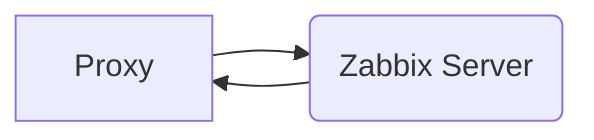
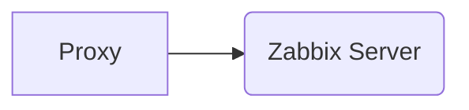

# Registration

Nous avons trois options en ce qui concerne la registration d'host sur notre Zabbix:
1. Ajouter manuellement
2. Faire du *discovery*
3. Auto-registration

> [!warning]+
> Pour le **serveur**, aucune restriction de connexion ne s'applique. Il autorise toute les connexions sur l'interface qu'il écoute. 
> 
> Pour le **proxy**, il faut configurer le **serveur** sur lequel il ira chercher sa configuration et enverra les données. 
> 
> Pour les **agents**, il est important de définir les `Server` et `ServerActive` valide. Dans le cas qu'un agent tente de se connecter sur un serveur qui n'est pas dans la liste valide, il refusera la connexion.

> [!info]-
> J'ai fais certaine recherche à propos de la découverte d'host et de l'auto-registration [[20230607-09.06 - Zabbix Auto-registration & Découverte|ici]].

## Discovery

Permet de scanner un subnet pour des agents. Je n'ai pas tester, ça n'avais pas l'air très utile dans notre cas.

## Auto-registration

> [!info]
> Du côté serveur/proxy, pour limiter les hosts qui peuvent se connecter, il sera nécessaire de mettre en place un firewall.

Ça permet d'accepter des hosts qui ne sont pas encore ajouté dans le Zabbix et de faire certaine actions . Il est possible d'utilisé une clé d'encryption afin d'établir un échange sécuritaire. Lors de l'autoregistration, l'agent envoie sont hostname, et optionnellement du metadata. La clé `HostMetadata` permet de définir une valeur qui sera envoyé lors de l'autoregistration. C'est utile, par exemple, si on met dans `HostMetadata` une valeur Windows ou Linux pour lier un groupe d'host ou un template dépendant du système d'exploitation. 

> [!faq]- Est-ce qu'une requête d'auto-registration permet d'exécuter plusieurs actions?
> Oui, il suffit d'utiliser le bon sélecteur de *metadata* lors de la création de l'action. Lors de l'auto-registration, les conditions de chaque actions seront observer afin de voir si l'action doit être exécuter ou pas.

# Trigger

Un *trigger* est une fonction qui évaluera une ou plusieurs données et déterminera si une ou des conditions sont vrai ou fausse. Dans le cas qu'elle est vrai, le trigger sera actionner. Lorsqu'il est actionné il ouvre un problème. Chaque trigger on une sévérité. Par exemple:

1. Information
2. Warning
3. Critical

Il est possible de changer le titre du problème et d'insérer des données (elles seront capturés au moment de l'ouverture du problème) afin de permettre de comprendre le problème rapidement. Il est possible de définir le status actuelle dans `Operational Data`, ce champs permet d'insérer des données qui seront actualiser en temps réelle lorsque lue.

Il est possible de créer une *recovery expression*, qui permet de définir *comment* le problème doit être résolue. Comme ça, il est possible de définir un ceil légèrement plus haut/bas afin d'empêcher une alerte de ce résoudre et de se rouvrir deux secondes après (l'alerte flip plusieurs fois par minute).

# Alertes

Les alertes sont divers événements qui sont lancé par le système. Il est possible de configurer des étapes et conditions pour capturer ces événements et de faire certaine action face à ceux-ci.

## Trigger Actions

Lorsque le problème d'un trigger est lancé, il est possible de configurer ce qu'on fait avec ces informations. Par exemple, il est possible de configurer d'envoyé des notifications lorsqu'un trigger est actionnée. Nous sommes en mesure de mettre en place des conditions sur l'événements. Par exemple, dans quel *Host Group* le problème à t-il été créer? S'il est dans *X*, envoie un SMS à tout les utilisateurs. Ainsi, si on hiérarchise nos groupes d'hôtes, et crée plusieurs groupes pour différent type de sévérité, nous serions en mesure d'envoyer des alertes à plusieurs groupes. Les utilisateurs peuvent faire partie de plusieurs *User Groups*.

# Proxy

Un proxy est un serveur qui permet d'*offload* le traffic du serveur Zabbix principale. Des hosts se connecterons sur le proxy au lieu du serveur principale. Chaque proxy peuvent s'éxecuter en mode actif ou passif.

## Passif

Dans le cas d'un proxy passif, il ira chercher sa configuration principale dans le serveur principale. Chaque fois que les *items* des hosts appartenant au proxy doivent être mis à jour, le serveur principale fera un requête sur le proxy. Donc, le processus ressemble à ceci:

## Actif

Dans le cas d'un proxy actif, le proxy ira chercher sa configuration sur le serveur principal, tout comme en mode passif, la différence est qu'il enverra les items quand *il* voudra les envoyé. Bien entendu, c'est configurable. Donc le serveur Zabbix n'est pas en mesure de *demander* des informations *on-the-fly*. Il doit attendre le proxy lui envoie les informations qu'ils à collecter.

Dans le cas qu'un proxy tombe inactif, le serveur va rediriger les hosts qui appartenait à ce host sur le serveur principale. Lorsque le proxy revient en ligne, les hosts retournerons sur le proxy.

# High Availability

Il est possible de configurer Zabbix afin d'assurer un meilleur temps de service. [[20230703-09.07 - Zabbix HA|En Savoir Plus]].

# Checkup

1. Recovery scripts
2. Pinging multiple IPs for the same Host

#zabbix 
# References
1. https://www.zabbix.com/documentation/current/en/manual/discovery/auto_registration
2. [[20230607-09.06 - Zabbix Auto-registration & Découverte]]